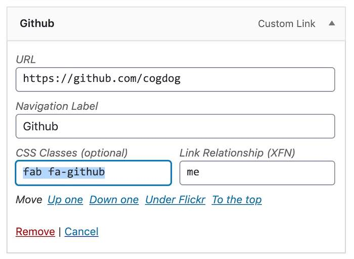

# Iconic Font Menus
by Alan Levine https://cog.dog/

-----
*If this kind of stuff has any value to you, please consider supporting me so I can do more!*

 

----- 

A slight tweak to the [Font Awesome 4 Menus plugin](https://wordpress.org/plugins/font-awesome-4-menus/) updated to work with Font Awesome 5 used in my [Calling Card WordPress themes](https://cogdog.github.io/#wpcards).

Below are some mods of the original plugin readme.

See it in action:

* http://lab.cogdogblog.com/dimension/
* https://cog.dog

## Description

This is an update to the [Font Awesome 4 Menus plugin by New Nine Media](https://wordpress.org/plugins/font-awesome-4-menus/) updated to work with Font Awesome 5 (their plugin has not been updated).

The settings allow you to use the Font Awesome 5 fonts included in the plugin, or to specify a URL to a CDN hosted one, or to skip using if one is enabled by another plugin or theme.

With this plugin, just add the full Font Awesome classes, e.g. `fab fa-(icon name)`  as a class/classes to your menu and the plugin will pull that out, put the icon before or after your link text, and wrap your link text in a span so you can show or hide it as you see fit.

In Font Awesome 5 Menus, you also have ability to add multiple Font Awesome classes for multiple effects. 

In addition, you can use shortcodes to add icons to your posts and pages, as well as shortcodes to take advantage of the new stacked feature of Font Awesome 5.

## Installation

Download this repository as a .zip file then upload it as a plugin in your WordPress dashboard. 

Then, activate the plugin through the 'Plugins' menu in WordPress. Look for a menu item under the **Settings** menu.

## Not Limited to Version 5

My decision to name this plugin tied to version 5 was not the best choice, and credit to the original plugin for allowing a setting to load the Font Awesome from an external CDN. So you can use this plugin to allow Font Awesome 6 icons.

In the plugin's Settings under **Load Font Awesome 5 From:** change the option from `Local plugin folder (default)` to  `A custom location:` and find the CDN hosted version you want from https://cdnjs.com/libraries/font-awesome -- in the case below, we are using All of the version 6.2 free icons `https://cdnjs.cloudflare.com/ajax/libs/font-awesome/6.2.0/css/all.min.css`

## Frequently Asked Questions

### Why not use the Official Font Awesome Plugin

It's great! I use it often. This one merely makes it possibly to create a WordPress menu of icons only by using CSS class names. There are no conflicts.

### Where can I find all of the available icons?

Head over to [the Font Awesome website](https://fontawesome.com/icons "the Font Awesome website") to find a full list of icons available. The plugin works with all free icons.

### How to I add an icon to my menu? 

Go to **Appearance** -> **Menus**. Use the **Screen** Options tab (upper right) and check the box for CSS Classes to make it available for all menu items. 

Select which menu item to which you want to add the icon and add the icon class(es) under 'CSS Classes (optional)'.

To add the [home icon](https://fontawesome.com/icons/home?style=solid) to your 'Home' link, enter "fas fa-home" (without quotes) as a class. To make it spin, add "fas fa-home fa-spin" as your classes. 

Save your menu and enjoy the icons!

### How do I use the shortcodes?

It took some digging to check that these work (the original plugin had no explanation of the stacking shortcode).

Use `[fa class="fab fa-twitter"]` to create a twitter icon. Of course, if you are doing this, why not go to the HTMl editor and just enter `&lt;i class="fab fa-twitter"&gt;&lt;/i&gt;` but hey. 

You can include the [size](https://fontawesome.com/how-to-use/on-the-web/styling/sizing-icons) and [rotation](https://fontawesome.com/how-to-use/on-the-web/styling/rotating-icons) classes as well. Here I entered in my WordPress editor:

     I got my [fa class="fas fa-apple-alt fa-5x"] 
     and then I went [fa class="fab fa-twitter fa-rotate-270 fa-5x"]

which the plugin renders as:

There is also a `[fa-stack]` shortcode for rendering [stacked icons](https://fontawesome.com/how-to-use/on-the-web/styling/stacking-icons). This format requires opening and closing shortcode tags, and inside you will enter separate `[fa]` shortcodes for the icons- e.g. for 2 icons stacked (note wrapping one in a span tag to color it, if anyone really uses this I could add a wrapping style option)):

     [fa-stack class="fa-2x"]
       [fa class="fas fa-camera fa-stack-1x"]
       [fa class="fas fa-ban fa-stack-2x"]
     [/fa-stack]
 
which produces

   

YMMV

## Updates

* 5.3 - Settings page shows version installed local (5.12) and more details on how to user versions 6.x using the custom location. 
* 5.2 - cleaned up documentation for hopeful submission to WordPress repo. Wish me luck.
* 5.1 - added plugin links to settings, and renamed the menu name to not be confused with the official Font Awesome plugin
* 5.01 - adjusted to fix `fa` shortcode and verify the `fa-stack` one works.
* 5.0 - the very first attempt to get this to work, just tweaked the original plugin slightly.

.

